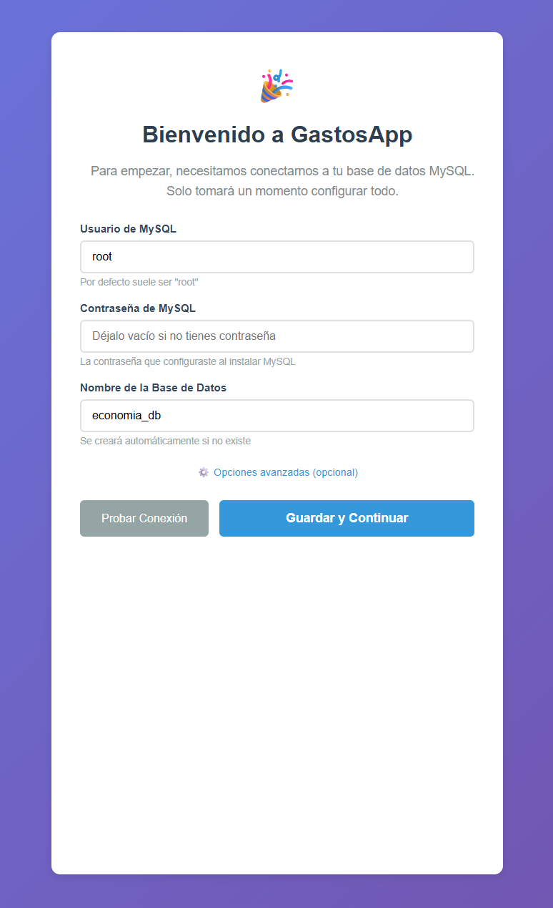
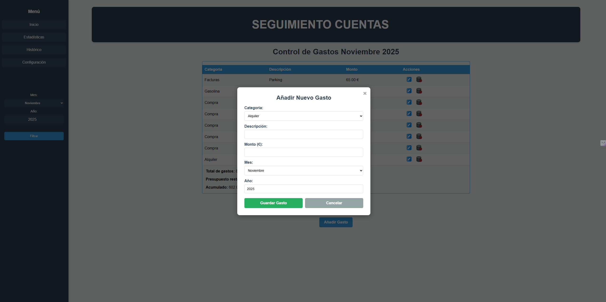
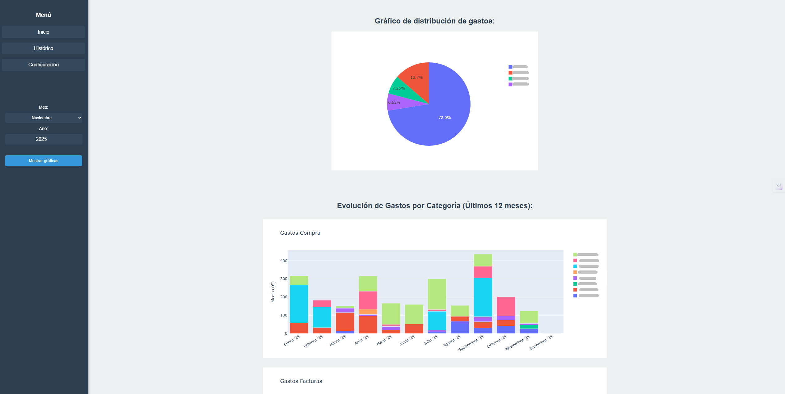
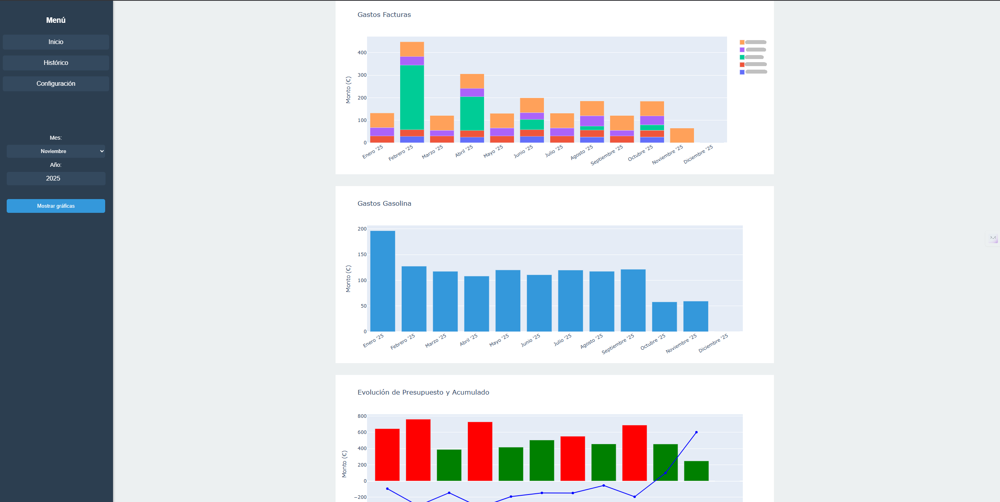
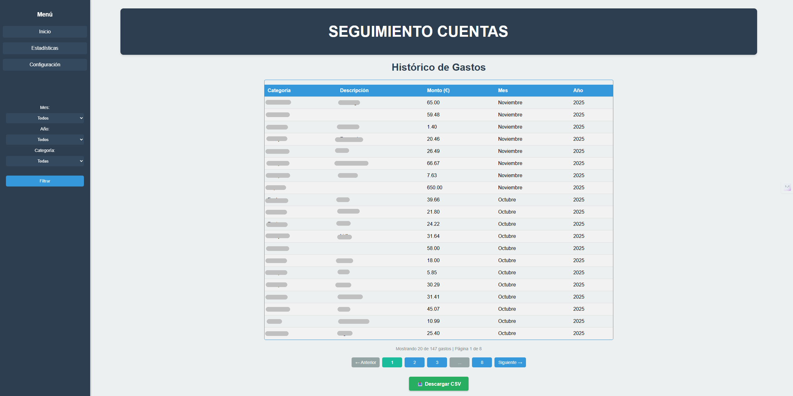
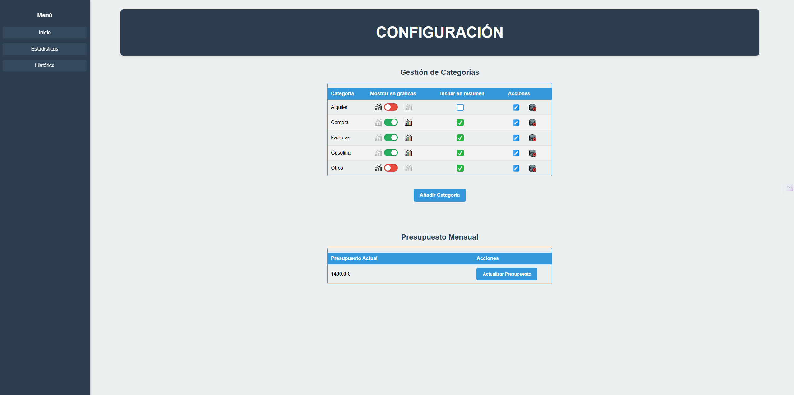

# 💰 Sistema de Control de Gastos Domésticos

Sistema web completo para gestionar gastos personales/familiares con reportes visuales, presupuestos y backups automáticos.

[](https://www.python.org/downloads/)
[](https://flask.palletsprojects.com/)
[](https://www.mysql.com/)
[](LICENSE)
[](tests/)
[](https://pep8.org/)

---

## 📋 Descripción

Aplicación web Flask para el seguimiento y análisis de gastos domésticos con:

- ✅ **Dashboard intuitivo** con resumen mensual de gastos
- 📊 **Gráficos interactivos** (Plotly) para visualizar tendencias
- 💵 **Presupuestos configurables** con alertas de sobrecosto
- 💾 **Backups automáticos** programados de la base de datos
- 🧪 **Tests completos** (54 unitarios + 8 de integración)
- 🖥️ **Ejecutable Windows** para uso sin instalación de Python

Ideal para llevar control de gastos familiares, analizar patrones de consumo y mantenerse dentro del presupuesto.

---

## ✨ Características Principales

### 🏠 Dashboard de Gastos

- Vista mensual de todos los gastos con totales
- Filtros por mes, año y categoría
- Comparación automática con presupuesto
- Alertas visuales de sobrecosto
- Interfaz responsive y amigable

### 📊 Reportes y Estadísticas

- **Gráfico de torta**: Distribución de gastos por categoría
- **Gráficos de barras**: Evolución histórica (12 meses)
- **Comparativa presupuesto**: Gastos vs presupuesto mensual
- **Gráficas configurables**: Control de visibilidad de categorías por gráfica
- **Resumen personalizado**: Selección de categorías incluidas en evolución presupuesto/gastos
- **Interactividad Plotly**: Zoom, hover, descarga de gráficos

### ⚙️ Configuración Flexible

- **Gestión de categorías personalizables**: Crear, editar y eliminar categorías
- **Control de visibilidad en gráficas**: Toggle individual por categoría para mostrar/ocultar en gráficos
- **Inclusión en resumen**: Checkbox para incluir/excluir categorías del gráfico de evolución presupuesto/gastos
- **Presupuestos mensuales configurables**: Establecer y ajustar presupuestos por mes
- **Histórico completo de gastos**: Visualización y gestión de todos los registros con paginación

### 💾 Sistema de Backups (Windows)

- Backups automáticos programados (3:00 AM)
- Compresión con WinRAR
- Sincronización automática a OneDrive
- Rotación inteligente (7 diarios / 4 semanales / 12 mensuales)
- Scripts PowerShell incluidos

### 🖥️ Ejecutable Windows

- **Generación de .exe**: Crea un ejecutable independiente con PyInstaller
- **Auto-lanzamiento**: Abre el navegador automáticamente
- **Configuración embebida**: No requiere archivos externos
- **Icono personalizable**: Elige tu propio icono
- Ver documentación completa en [docs/EXECUTABLE.md](docs/EXECUTABLE.md)

### 🧪 Calidad de Código

- 62 tests automatizados (54 unitarios + 8 de integración)
- Cobertura completa de servicios y queries
- Linting con flake8 (PEP 8)
- Type hints en funciones críticas
- Documentación completa en carpeta `docs/`

---

## 📦 Descarga Rápida (Usuarios Finales)

**¿Solo quieres usar la aplicación sin complicaciones técnicas?**

👉 **[Descargar GastosApp v2.3.2 para Windows](https://github.com/asanlir/GastosApp/releases/latest)**

### ¿Qué necesitas?

✅ **Windows 10/11**  
✅ **MySQL instalado** ([Descargar MySQL](https://dev.mysql.com/downloads/mysql/))

### Pasos sencillos:

1. Descarga el archivo `GastosApp-v2.3.2-Windows.zip` desde [Releases](https://github.com/asanlir/GastosApp/releases/latest)
2. Descomprime el archivo en tu carpeta preferida
3. **Doble clic en `Gastos.exe`**
4. Completa el asistente de configuración web con tus credenciales de MySQL
5. **¡Listo!** 🎉 La aplicación creará automáticamente la base de datos

La aplicación se abrirá automáticamente en tu navegador.

<p align="center">
  
  <br>
  <em>Asistente de configuración al primer arranque</em>
</p>

> **Nota:** Si no tienes MySQL instalado, sigue la [guía rápida de instalación de MySQL](https://dev.mysql.com/doc/mysql-installation-excerpt/8.0/en/).

> Consejo: Si ya tienes un archivo `.env` configurado, el asistente no aparecerá y la aplicación abrirá directamente el panel principal.

---

## 📷 Capturas de pantalla

Una vista rápida de la aplicación (capturas reales):

<!-- Imagen destacada -->
<p align="center">
  
</p>

<br>

<!-- Pareja: Estadísticas -->
<p align="center">
  
  
</p>

<br>

<!-- Pareja: Histórico y Configuración -->
<p align="center">
  
  
</p>

---

## 🎯 Uso

### Agregar un Gasto

1. En el dashboard, hacer clic en **"Agregar Gasto"**
2. Seleccionar categoría, descripción y monto
3. Seleccionar mes y año
4. Hacer clic en **"Guardar Gasto"**

### Ver Reportes

1. Ir a **"Estadísticas"** en el menú lateral
2. Seleccionar mes y año
3. Ver gráficos interactivos de distribución y evolución

### Configurar Presupuesto

1. Ir a **"Configuración"** en el menú lateral
2. En la sección "Presupuesto", ingresar monto mensual
3. Hacer clic en **"Guardar Presupuesto"**

### Gestionar Categorías

1. Ir a **"Configuración"**
2. Agregar nueva categoría o editar/eliminar existentes
3. **Configurar visibilidad**: Usar el toggle para mostrar/ocultar la categoría en todas las gráficas
4. **Incluir en resumen**: Marcar checkbox para incluir la categoría en el gráfico de evolución de presupuesto/gastos
5. Los cambios se aplican inmediatamente a los gráficos

### Configurar Visibilidad de Gráficas

Las categorías tienen dos controles independientes en la página de configuración:

- **Toggle "Mostrar en gráficas"**: Muestra u oculta la gráfica de barras de esa categoría.
- **Checkbox "Incluir en resumen"**: Controla si la categoría se incluye en el gráfico de evolución del presupuesto y total de gastos

Esto te permite, por ejemplo, excluir gastos fijos (como alquiler) del análisis de tendencias sin ocultarlos completamente.

---

## 🚀 Instalación para Desarrolladores

### Requisitos Previos

- Python 3.11+
- MySQL 8.0+
- WinRAR (para backups en Windows)
- Git

### 1. Clonar el Repositorio

```bash
git clone https://github.com/asanlir/GastosApp.git
cd GastosApp
```

### 2. Configurar Entorno Virtual

```bash
# Crear entorno virtual
python -m venv venv

# Activar entorno virtual
# En Windows:
venv\Scripts\activate
# En Linux/Mac:
source venv/bin/activate
```

### 3. Instalar Dependencias

```bash
pip install -r requirements.txt
```

### 4. Configurar Variables de Entorno

Copia el archivo de ejemplo y configura tus valores:

```bash
cp .env.example .env
```

Edita `.env` con tus configuraciones:

```env
# Base de datos
DB_HOST=localhost
DB_USER=tu_usuario
DB_PASSWORD=tu_password
DB_NAME=economia_db
DB_PORT=3306

# Flask - IMPORTANTE: Genera una SECRET_KEY única
SECRET_KEY=tu_clave_secreta_aqui

# Logging
LOG_LEVEL=INFO
```

**⚠️ IMPORTANTE para Producción:**

Genera una SECRET_KEY fuerte:

```bash
python -c "import secrets; print(secrets.token_urlsafe(32))"
```

O usa el script helper:

```bash
python scripts/generate_secret_key.py
```

La aplicación en modo producción **rechazará** iniciar si detecta la SECRET_KEY por defecto.

### 5. Iniciar la Aplicación

```bash
python app.py
```

**🎉 ¡Listo!** La aplicación creará automáticamente la base de datos y las tablas en el primer arranque.

La aplicación estará disponible en: **http://127.0.0.1:5000**

> **Nota:** Si tu usuario MySQL no tiene permisos para crear bases de datos, consulta la sección [Inicialización Manual](#inicialización-manual-opcional) más abajo.

---

## 🔧 Inicialización Manual (Opcional)

Si prefieres crear la base de datos manualmente o tu usuario MySQL no tiene permisos de `CREATE DATABASE`, puedes usar el script `init_db.py`:

```bash
# Inicializa una BD nueva con esquema y datos de ejemplo
python init_db.py --db-name economia_db --seed-sample

# Si la BD ya existe, usa --force (no borra datos)
python init_db.py --db-name economia_db --force
```

O crear manualmente:

```sql
CREATE DATABASE economia_db CHARACTER SET utf8mb4 COLLATE utf8mb4_unicode_ci;
USE economia_db;
SOURCE database/schema.sql;
```

---

## 📁 Estructura del Proyecto

```
GastosApp/
├── app/                          # Paquete principal de la aplicación
│   ├── __init__.py               # Factory de Flask
│   ├── config.py                 # Configuración por entornos
│   ├── constants.py              # Constantes globales
│   ├── database.py               # Gestión de conexiones BD
│   ├── exceptions.py             # Excepciones personalizadas
│   ├── logging_config.py         # Configuración de logs
│   ├── queries.py                # Queries SQL centralizadas
│   ├── utils.py                  # Funciones auxiliares
│   ├── utils_df.py               # Utilidades para DataFrames
│   ├── routes/                   # Rutas Flask
│   │   └── main.py               # Endpoints principales
│   └── services/                 # Lógica de negocio
│       ├── gastos_service.py
│       ├── categorias_service.py
│       ├── presupuesto_service.py
│       └── charts_service.py
├── database/                     # Scripts de base de datos
│   ├── schema.sql                # Estructura de tablas
│   ├── add_indexes.sql           # Índices optimizados
│   ├── seed.sql                  # Datos iniciales
│   └── INDEXES.md                # Documentación de índices
├── scripts/                      # Scripts de utilidad
│   ├── backup_db.ps1             # Backup de base de datos
│   ├── setup_backup_task.ps1     # Configurar tarea programada
│   ├── sync_to_cloud.ps1         # Sincronización OneDrive
│   └── migrations/               # Migraciones de base de datos
│       ├── 001_add_presupuesto_indexes.py
│       ├── 002_add_mostrar_en_graficas.py
│       ├── 003_add_incluir_en_resumen.py
│       └── README.md             # Guía de migraciones
├── static/                       # Archivos estáticos
│   └── styles.css                # Estilos CSS
├── templates/                    # Templates HTML
│   ├── index.html                # Dashboard principal
│   ├── gastos.html               # Histórico de gastos
│   ├── report.html               # Reportes y gráficos
│   └── config.html               # Configuración
├── tests/                        # Tests automatizados
│   ├── conftest.py               # Configuración pytest
│   ├── test_endpoints.py         # Tests de integración
│   ├── test_services.py          # Tests unitarios servicios
│   ├── test_queries.py           # Tests unitarios queries
│   └── test_utils.py             # Tests utilidades
├── logs/                         # Logs de la aplicación (generado)
├── app.py                        # Punto de entrada
├── requirements.txt              # Dependencias producción
├── requirements-dev.txt          # Dependencias desarrollo
└── .env                          # Variables de entorno (no versionado)
```

---

## 🔄 Migraciones de Base de Datos

El proyecto incluye un sistema de migraciones para actualizar la estructura de la base de datos de forma segura sin perder datos existentes.

### Ejecutar Migraciones

Las migraciones están en `scripts/migrations/` y deben ejecutarse en orden:

```bash
# Ejecutar una migración específica
python scripts/migrations/002_add_mostrar_en_graficas.py

# O ejecutar manualmente con el runner de migraciones
python -c "from scripts.migrations.002_add_mostrar_en_graficas import up; up()"
```

### Migraciones Disponibles

1. **001_add_presupuesto_indexes.py**: Añade índices optimizados a la tabla presupuesto
2. **002_add_mostrar_en_graficas.py**: Añade columna `mostrar_en_graficas` a categorías
3. **003_add_incluir_en_resumen.py**: Añade columna `incluir_en_resumen` a categorías

Las migraciones son **idempotentes** (se pueden ejecutar múltiples veces de forma segura) y verifican la existencia de columnas antes de añadirlas.

Para más información, consulta: `scripts/migrations/README.md`

---

## 🧪 Testing

El proyecto incluye una suite completa de tests:

```bash
# Ejecutar todos los tests
pytest tests/

# Solo tests unitarios (sin base de datos)
pytest tests/ -m "not integration"

# Tests con cobertura
pytest tests/ --cov=app --cov-report=html

# Tests específicos
pytest tests/test_services.py -v
```

### Cobertura de Tests

- ✅ **54 tests unitarios**: Servicios, queries, utilidades
- ✅ **8 tests de integración**: Endpoints y flujos completos
- ✅ **CI/CD**: GitHub Actions ejecuta tests automáticamente

---

## 💾 Sistema de Backups

### ⚠️ Gestión Segura de Base de Datos

**IMPORTANTE**: Para evitar pérdida accidental de datos, consulta la guía completa:

📖 **[docs/DATABASE_MANAGEMENT.md](docs/DATABASE_MANAGEMENT.md)** - Guía de Gestión de Base de Datos

**Reglas básicas:**

```bash
# ✅ Para verificar el estado de la BD
python check_db.py

# ✅ Para agregar una tabla específica (SEGURO con datos existentes)
python add_table.py presupuesto

# ❌ NO ejecutar con datos existentes (puede causar pérdida)
python init_db.py  # Solo para BD vacías
```

### Configuración de Backups Automáticos

```powershell
# Ejecutar como Administrador
cd scripts
.\setup_backup_task.ps1
```

Esto creará una tarea programada de Windows que:

- Se ejecuta diariamente a las 3:00 AM
- Hace backup de la base de datos con `mysqldump`
- Comprime el backup con WinRAR
- Sincroniza a OneDrive automáticamente
- Mantiene rotación de backups (7/4/12)

### Backup Manual

```powershell
.\scripts\backup_db.ps1
```

### Restaurar Backup

```bash
# Descomprimir el archivo
# Luego:
mysql -u root -p economia_db < backup_file.sql
```

---

## 🏗️ Arquitectura

### Patrón de Diseño

La aplicación sigue una **arquitectura en capas**:

1. **Presentación** (`routes/`): Endpoints Flask
2. **Lógica de Negocio** (`services/`): Servicios reutilizables
3. **Acceso a Datos** (`queries.py`): Queries SQL parametrizadas
4. **Base de Datos**: MySQL con índices optimizados

### Decisiones Técnicas

- **Factory Pattern**: `create_app()` permite múltiples entornos
- **Dependency Injection**: Servicios desacoplados
- **Query Builders**: SQL centralizado y seguro (anti-SQL injection)
- **Context Managers**: Gestión automática de conexiones BD
- **Excepciones Tipadas**: Manejo de errores específico

---

## 🔧 Configuración Avanzada

### Entornos

```python
# Desarrollo (default)
app = create_app('development')  # DEBUG=True, LOG_LEVEL=DEBUG

# Producción
app = create_app('production')   # DEBUG=False, LOG_LEVEL=WARNING

# Testing
app = create_app('testing')      # TESTING=True, test_economia_db
```

### Logging

Los logs se guardan en `logs/gastos.log` con rotación automática:

- **DEBUG**: Desarrollo (todas las operaciones)
- **INFO**: Producción (operaciones importantes)
- **WARNING**: Solo errores y advertencias

```python
# Cambiar nivel de logging
# En .env:
LOG_LEVEL=DEBUG  # DEBUG, INFO, WARNING, ERROR, CRITICAL
```

---

## 🚢 Deployment

### Opción 1: Servidor Local (Windows)

```bash
# Producción con Waitress
pip install waitress
waitress-serve --port=5000 app:app
```

### Opción 2: Heroku

```bash
# Asegurarse de tener Procfile
heroku create tu-app-gastos
heroku addons:create jawsdb:kitefin  # MySQL en Heroku
git push heroku main
```

### Opción 3: Docker

```dockerfile
# Dockerfile (ejemplo)
FROM python:3.11-slim
WORKDIR /app
COPY requirements.txt .
RUN pip install --no-cache-dir -r requirements.txt
COPY . .
CMD ["gunicorn", "-b", "0.0.0.0:5000", "app:app"]
```

---

## 🤝 Contribuir

Las contribuciones son bienvenidas! Por favor:

1. Fork el proyecto
2. Crea una rama para tu feature (`git checkout -b feature/AmazingFeature`)
3. Commit tus cambios (`git commit -m 'Add AmazingFeature'`)
4. Push a la rama (`git push origin feature/AmazingFeature`)
5. Abre un Pull Request

### Estándares de Código

- Seguir PEP 8
- Añadir docstrings a funciones públicas
- Escribir tests para nuevas features
- Mantener cobertura de tests > 80%

---

## 📝 Changelog

### v2.3.2 (2025-12-08)

**🔧 Correcciones de Bugs**

- 🐛 **Fix**: Corregido nombre de función `generate_category_chart` en endpoint `/report`
  - Resuelto error AttributeError que causaba crash al acceder a reportes
  - Función generadora de gráficos de categorías ahora se llama correctamente
- ✅ **Calidad**: Verificación de integridad en compilación

### v2.3.1 (2025-11-29)

**📊 Mejoras en Gráficos y Visualizaciones**

- 📉 **Gráfico de Resumen y Comparativa**:
  - Nueva línea de gasto medio acumulado
  - Gasto medio calculado con gastos incluidos en resumen
  - Visualización en tiempo real de la evolución del promedio mensual

### v2.3.0 (2025-11-11)

**🎯 Asistente de Configuración y Auto-inicialización**

- 🧙‍♂️ **Asistente de Configuración Web**:
  - Wizard interactivo al primer arranque del ejecutable
  - Configuración de credenciales MySQL sin editar archivos
  - Endpoint AJAX de prueba de conexión en tiempo real
  - Template completo con opciones avanzadas y validación dinámica
- 🔄 **Auto-inicialización de Base de Datos**:
  - Creación automática de `economia_db` y esquema en primer arranque
  - Middleware de redirección a `/setup` si falta `.env`
  - Manejo robusto de errores con mensajes guiados"
- 🔧 **Correcciones README**:
  - Nota sobre comportamiento con `.env` existente
- 🔒 **Seguridad**: Sanitización de rutas personales en documentación

**📦 Distribución**: `GastosApp-v2.3.0-Windows.zip` (166 MB)  
**SHA256**: `D4706A57C3059A042BDF2EDD524453F78913395763AA1E7049603BB802BD5761`

### v2.2.0 (2025-11-03)

**🖥️ Sistema de Ejecutable y Mejoras de Visualización**

- 💽 **Ejecutable Windows**:
  - Sistema completo de generación de .exe con PyInstaller
  - Auto-lanzamiento del navegador al ejecutar
  - Configuración embebida y aislada
  - Icono personalizable
  - Documentación completa en [docs/EXECUTABLE.md](docs/EXECUTABLE.md)
- 📊 **Control Avanzado de Visualización de Gráficas**:
  - Toggle individual por categoría para mostrar/ocultar en gráficos
  - Checkbox para incluir/excluir del gráfico de evolución presupuesto/gastos
  - Animaciones suavizadas para transiciones de UI
  - Interfaz intuitiva de configuración
- 🗄️ **Base de Datos Unificada**:
  - Sincronización entre ejecutable y desarrollo
  - Sistema de backup único para todo
- 📚 **Documentación**: README mejorado para publicación

### v2.1.0 (2025-10-30)

**🎉 Finalización refactorización y mejoras UX**

- 🎨 Mejoras de Experiencia de Usuario
- 🛡️ Protección de Datos
- 🧹 Limpieza y Optimización
- ✅ Calidad: 68/68 tests pasando
- 🚀 Lista para producción

### v2.0.0 (2025-01-29)

**✨ Refactor completo a arquitectura modular**

- 🧪 Suite completa de 62 tests
- 📊 Sistema de logging robusto
- 🔒 Excepciones tipadas y manejo de errores
- 💾 Sistema de backups automáticos
- 📚 Documentación completa

### v1.0.0 (2024-xx-xx)

- 🧱 Versión inicial monolítica

---

## 🤝 Contribuir

¡Las contribuciones son bienvenidas! Por favor:

1. Fork el proyecto
2. Crea tu rama de feature (`git checkout -b feature/AmazingFeature`)
3. Commit tus cambios (`git commit -m 'feat: Add some AmazingFeature'`)
4. Push a la rama (`git push origin feature/AmazingFeature`)
5. Abre un Pull Request

Lee [CONTRIBUTING.md](CONTRIBUTING.md) para más detalles sobre nuestro código de conducta y proceso de desarrollo.

---

## 📄 Licencia

Este proyecto está bajo la Licencia MIT. Ver archivo [LICENSE](LICENSE) para más detalles.

---

## 👤 Autor

**Alejandro Sánchez**

- GitHub: [@asanlir](https://github.com/asanlir)
- Repository: [GastosApp](https://github.com/asanlir/GastosApp)

---

## 🙏 Agradecimientos

- [Flask](https://flask.palletsprojects.com/) - Framework web ligero y potente
- [Plotly](https://plotly.com/python/) - Gráficos interactivos hermosos
- [PyMySQL](https://pymysql.readthedocs.io/) - Conector MySQL puro Python
- [Pandas](https://pandas.pydata.org/) - Análisis de datos
- [PyInstaller](https://pyinstaller.org/) - Empaquetado de ejecutables

---

## ⭐ ¿Te gustó el proyecto?

Si este proyecto te resultó útil, considera darle una ⭐ en GitHub. ¡Gracias!

- [Pytest](https://pytest.org/) - Framework de testing

---

## 📞 Soporte

Si encuentras algún problema o tienes sugerencias:

- 🐛 [Reportar un bug](https://github.com/asanlir/GastosApp/issues)
- 💡 [Solicitar una feature](https://github.com/asanlir/GastosApp/issues)
- 📧 Contacto: [Crear issue en GitHub]

---

**⭐ Si este proyecto te fue útil, considera darle una estrella!**
