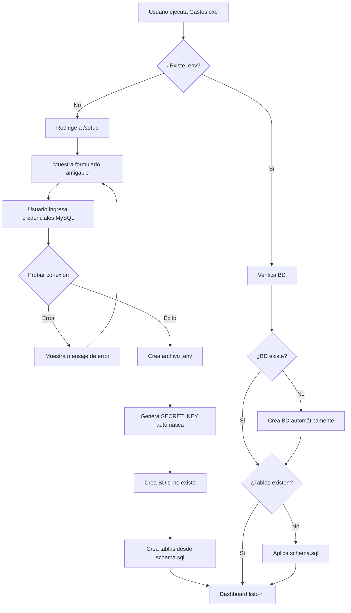

# 📦 Construcción de Ejecutable Aislado

Este documento explica cómo construir un ejecutable (.exe) de la aplicación de gastos que:

- ✅ Usa la misma base de datos que el desarrollo (economia_db)
- ✅ **Configuración inicial asistida** con formulario web amigable
- ✅ Incluye todos los recursos necesarios (templates, static)
- ✅ Lanza automáticamente el navegador al ejecutarse
- ✅ **Autosuficiente**: solo requiere MySQL instalado

## 🎯 ¿Por qué un ejecutable?

El ejecutable te permite:

1. **Usar la aplicación sin abrir VS Code o terminal**
2. **Acceso rápido** desde el escritorio o menú inicio
3. **Experiencia de usuario más amigable** con auto-lanzamiento del navegador
4. **Mismo conjunto de datos** que cuando desarrollas
5. **Configuración automática** a través de asistente web

## 👨🏻‍💻 Experiencia para Usuarios Finales

### Primera Vez (Sin .env)

1. Usuario descarga `GastosApp.exe` desde [Releases](https://github.com/asanlir/GastosApp/releases)
2. Doble clic en `Gastos.exe`
3. Se abre el navegador automáticamente en `http://127.0.0.1:5000/setup`
4. Usuario ve un formulario amigable:

```
┌────────────────────────────────────────────┐
│  🎉 Bienvenido a GastosApp                │
│                                            │
│  Usuario MySQL:    [root              ]    │
│  Contraseña:       [                  ]    │
│  Nombre BD:        [economia_db       ]    │
│                                            │
│  ⚙️ Opciones avanzadas (opcional)         │
│                                            │
│  [Probar Conexión] [Guardar y Continuar]   │
└────────────────────────────────────────────┘
```

5. Usuario ingresa su contraseña de MySQL
6. Click en "Guardar y Continuar"
7. La app:
   - ✅ Crea automáticamente el archivo `.env`
   - ✅ Genera `SECRET_KEY` segura automáticamente
   - ✅ Crea la base de datos `economia_db`
   - ✅ Crea todas las tablas desde `schema.sql`
   - ✅ Redirige al dashboard principal

**¡Listo!** El usuario ya puede usar la aplicación.

### Siguientes Veces (Con .env)

1. Doble clic en `Gastos.exe`
2. Se abre directamente en el dashboard
3. Todo funciona automáticamente

## 🏗️ Arquitectura

```
┌─────────────────────────────────────────┐
│  Código Fuente (Desarrollo)             │
│  • python app.py                        │
│  • .env (configuración dev)             │
│  • economia_db (BD unificada)           │
└─────────────────────────────────────────┘
              ↕ (comparten la misma BD)
┌─────────────────────────────────────────┐
│  Gastos.exe (Ejecutable)                │
│  • .env auto-creado en /setup           │
│  • economia_db (BD unificada)           │
│  • Auto-lanza navegador                 │
│  • Asistente configuración embebido     │
└─────────────────────────────────────────┘
```

## 🔧 Flujo de Configuración Automática



## 📋 Prerrequisitos

### Para Construir el Ejecutable (Desarrolladores)

1. **PyInstaller** instalado:

   ```bash
   pip install pyinstaller
   ```

2. **Base de datos MySQL** funcionando con `economia_db`

### Para Usar el Ejecutable (Usuarios Finales)

1. **Solo MySQL instalado** ([Descargar aquí](https://dev.mysql.com/downloads/mysql/))
2. **Windows 10/11**

**¡Eso es todo!** No necesita Python, Git, ni conocimientos técnicos.

## 🚀 Construcción del Ejecutable

### Construcción

#### Opción 1: Script Automatizado (Recomendado)

```bash
# Con valores por defecto (nombre: GastosApp, icono: calc.ico)
python scripts/build_exe.py

# Con nombre personalizado
python scripts/build_exe.py --name Gastos

# Con icono personalizado
python scripts/build_exe.py --icon static/casa.ico

# Con ambos personalizados
python scripts/build_exe.py --name Gastos --icon static/casa.ico
```

Este script:

- ✅ Construye el ejecutable con tu nombre e icono elegidos
- ✅ Incluye el asistente de configuración web
- ✅ Empaqueta todos los recursos necesarios
- ✅ Muestra instrucciones de uso

**Opciones disponibles:**

| Opción   | Descripción                      | Por defecto       |
| -------- | -------------------------------- | ----------------- |
| `--name` | Nombre del ejecutable (sin .exe) | `GastosApp`       |
| `--icon` | Ruta al archivo .ico             | `static/calc.ico` |

**Nota:** Ya no necesitas crear `.env.exe` manualmente. El asistente de configuración web lo hace automáticamente al primer uso.

#### Opción 2: Manual

```bash
# Construir con PyInstaller
pyinstaller --name MiGastos --icon static/pig.ico --onefile app.py

# El ejecutable estará en: dist/MiGastos.exe
```

## ⚙️ Configuración

### Configuración Automática (Primera Ejecución)

Al ejecutar el `.exe` por primera vez sin `.env`:

1. Se abre automáticamente el asistente de configuración web
2. Usuario ingresa credenciales de MySQL
3. La app crea automáticamente el archivo `.env` con:

   - Credenciales de MySQL proporcionadas
   - `SECRET_KEY` generada automáticamente (criptográficamente segura)
   - Configuración por defecto para producción

4. Se crea la base de datos `economia_db` automáticamente
5. Se aplican todas las tablas desde `database/schema.sql`

**No es necesario crear `.env` manualmente** - el asistente lo hace todo.

### Configuración Manual (Opcional/Avanzado)

Si prefieres crear `.env` manualmente:

```env
# Base de datos
DB_HOST=localhost
DB_USER=root
DB_PASSWORD=tu_contraseña_mysql
DB_NAME=economia_db
DB_PORT=3306

# SECRET_KEY única (genera una con: python -c "import secrets; print(secrets.token_urlsafe(32))")
SECRET_KEY=<tu_secret_key_segura>

# Logging
LOG_LEVEL=INFO

# Modo de ejecución
FLASK_ENV=production
```

**⚠️ IMPORTANTE:**

- `.env` está en `.gitignore` (contiene SECRET_KEY y password)
- Nunca compartas `.env` públicamente
- La app y el ejecutable pueden usar la misma base de datos

## 🎮 Uso del Ejecutable

### Primera Vez

1. **Ejecutar:**

   ```bash
   cd dist
   Gastos.exe
   ```

2. **Se abre automáticamente** el navegador en `http://127.0.0.1:5000/setup`

3. **Completar formulario:**

   - Usuario MySQL (ej: `root`)
   - Contraseña MySQL
   - Nombre de BD (ej: `economia_db`)

4. **Click en "Guardar y Continuar"**

5. **¡Listo!** La app crea todo automáticamente y redirige al dashboard

### Siguientes Veces

1. **Ejecutar:**

   ```bash
   cd dist
   Gastos.exe
   ```

2. **Se abre directamente** en el dashboard (`http://127.0.0.1:5000`)

3. **Detener:** Presiona `Ctrl+C` en la consola

## 📊 Diferencias entre Entornos

| Característica         | Desarrollo                 | Ejecutable                    |
| ---------------------- | -------------------------- | ----------------------------- |
| **Comando**            | `python app.py`            | `Gastos.exe`                  |
| **Base de Datos**      | `economia_db`              | `economia_db` (misma)         |
| **Configuración**      | `.env`                     | `.env` (creado por asistente) |
| **Primera Ejecución**  | Requiere crear .env manual | Asistente web automático      |
| **Logs**               | `DEBUG`                    | `INFO`                        |
| **Cambios en código**  | ✅ Se aplican al reiniciar | ❌ Requiere rebuild           |
| **Recursos**           | Rutas del proyecto         | Empaquetados en .exe          |
| **Usuario no técnico** | ❌ Complejo                | ✅ Solo MySQL + doble clic    |

## 🔄 Actualizar el Ejecutable

Si haces cambios en el código que quieres en el ejecutable:

```bash
# Reconstruir el ejecutable
python scripts/build_exe.py

# O manualmente
pyinstaller app.spec --clean
```

**Nota:** El ejecutable anterior seguirá funcionando hasta que lo reemplaces.

## 🐛 Solución de Problemas

### El ejecutable no encuentra templates/static

**Solución:** Verifica que `app.spec` incluye los datas:

```python
datas=[
    ('static', 'static'),
    ('templates', 'templates'),
    ('.env.exe', '.'),
],
```

### Error de conexión a base de datos

**Solución:** Verifica `.env.exe`:

- DB_NAME apunta a `economia_db_prod`
- Usuario y contraseña son correctos
- La base de datos existe

### El ejecutable usa la BD de desarrollo

**Solución:** El ejecutable lee `.env.exe` empaquetado. Verifica:

```bash
# En app/config.py debe cargar .env.exe en modo frozen
env_file = get_env_file()  # Retorna .env.exe si is_frozen()
load_dotenv(env_file)
```

### Cambios en código no se reflejan en el ejecutable

**Respuesta:** Esto es **normal y esperado**. El ejecutable está aislado.
Para aplicar cambios, debes reconstruirlo con `python scripts/build_exe.py`.

## 📁 Archivos Relevantes

| Archivo                | Propósito                                    |
| ---------------------- | -------------------------------------------- |
| `app.spec`             | Configuración de PyInstaller                 |
| `.env.exe`             | Configuración del ejecutable (no versionado) |
| `.env.exe.example`     | Plantilla de configuración                   |
| `app/frozen_utils.py`  | Utilidades para modo frozen                  |
| `scripts/build_exe.py` | Script de construcción automatizado          |
| `dist/GastosApp.exe`   | Ejecutable generado                          |

## 🔐 Seguridad

- ✅ `.env.exe` está en `.gitignore`
- ✅ SECRET_KEY única generada automáticamente
- ✅ Base de datos separada (economia_db_prod)
- ⚠️ El ejecutable puede ser descompilado (PyInstaller no ofrece ofuscación completa)
- ⚠️ No incluir credenciales sensibles en el código

## 📚 Documentación Adicional

- [PyInstaller Documentation](https://pyinstaller.org/en/stable/)
- [Flask Deployment](https://flask.palletsprojects.com/en/2.3.x/deploying/)
- [MySQL Backup/Restore](https://dev.mysql.com/doc/refman/8.0/en/mysqldump.html)

---

**💡 Tip:** Mantén el ejecutable en una carpeta separada de tu código fuente para evitar confusiones entre desarrollo y producción.
